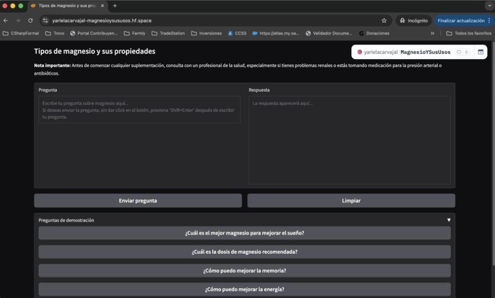
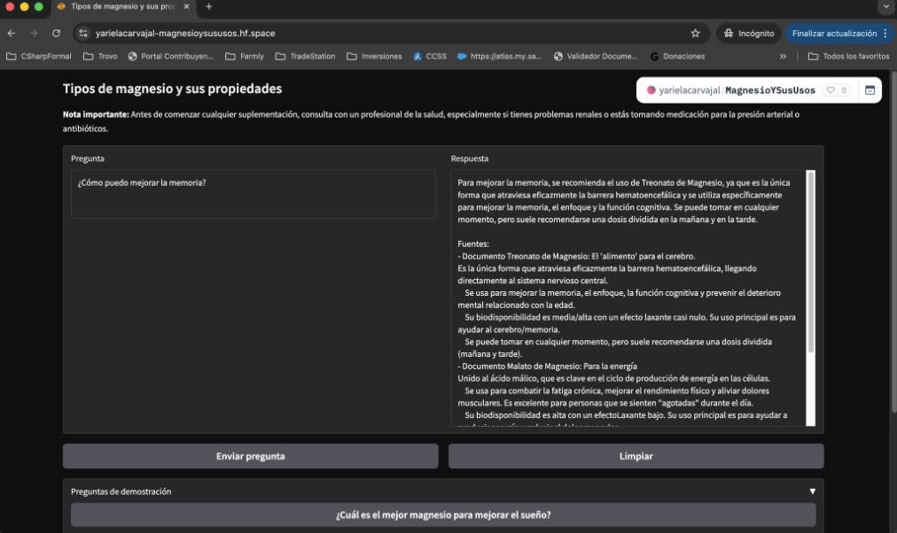
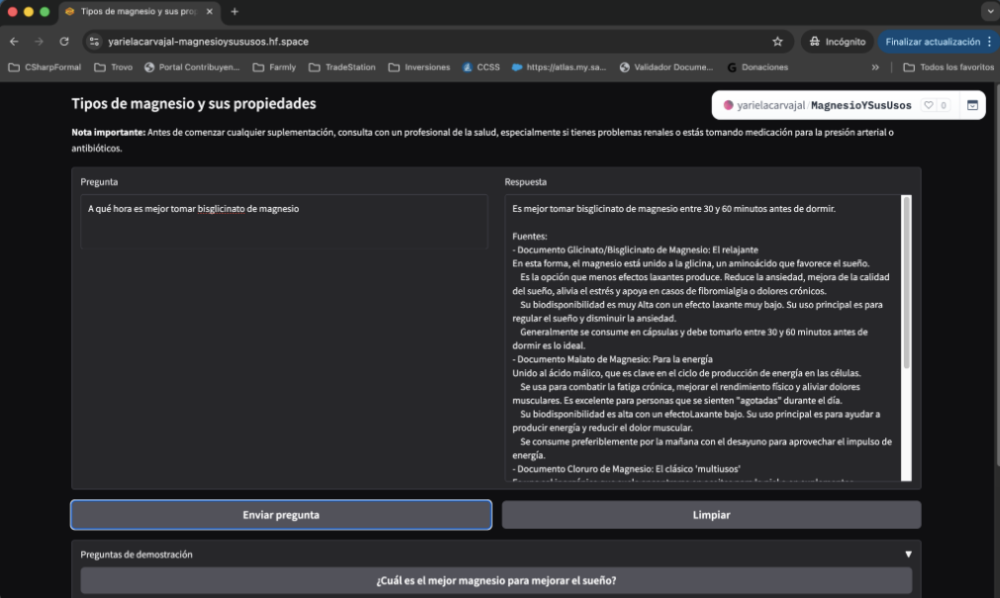

# Proyecto Final - Fundamentos de Programación
## Máster en Machine Learning e Inteligencia Artificial
## OBS Business School
## Estudiante: Yariela Carvajal Paniagua

## Tipos de magnesio y sus propiedades

Aplicación Gradio con sistema RAG usando LangChain y OpenAI.

## Descripción

Esta aplicación ofrece información sobre distintos tipos de magnesio, sus usos, niveles de absorción, efectos laxantes y recomendaciones generales. Incluye una nota importante siempre visible en la interfaz y muestra las fuentes usadas en cada respuesta. 
El usuario final deberá ingresar una pregunta o, en su defecto, seleccionar una de las que hay de demostración y dar clic en "Enviar pregunta", la aplicación le generará una respuesta acorde a los textos incluidos en la aplicación. 
Si desea limpiar el contenido en las celdas de pregunta y respuesta, deberá dar clic en el botón "Limpiar".

## Tecnologías utilizadas

- Gradio: para la interfaz web interactiva.
- LangChain: para el flujo RAG (Recuperación + Generación).
- OpenAI API: modelo GPT-4o-mini para generación de respuestas.
- Hugging Face Embeddings: para generar vectores semánticos de los documentos.
- FAISS: índice en memoria para búsqueda de similitud.

## Cómo ejecutar

1. Crear un entorno virtual de Python:
   ```bash
   python3 -m venv .venv
   source .venv/bin/activate
   ```

2. Instalar dependencias:
   ```bash
   pip install -r requirements.txt
   ```

3. Configurar credenciales de OpenAI:
   - Exporta la variable de entorno `OPENAI_API_KEY`
   - En Hugging Face Spaces, configura el secret `OPENAI_API_KEY` con el contenido de la clave de servicio

4. Ejecutar la app:
   ```bash
   python app.py
   ```

5. Abrir la URL local que muestre Gradio.

## Aplicación desplegada en HuggingFace
https://yarielacarvajal-magnesioysususos.hf.space/


## Notas

- La app está diseñada para despliegue en Hugging Face Spaces.
- La nota importante siempre se muestra en la interfaz para advertir al usuario sobre consultar con un profesional de la salud.
- Se incluyen preguntas de demostración que se pueden seleccionar individualmente.

## Capturas de pantalla de la aplicación funcionando



